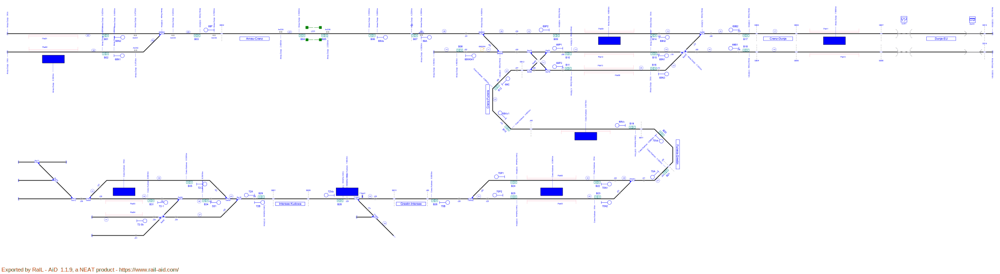
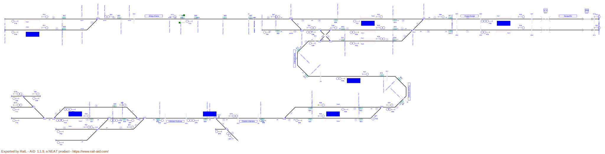
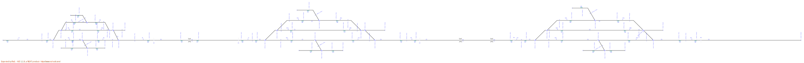
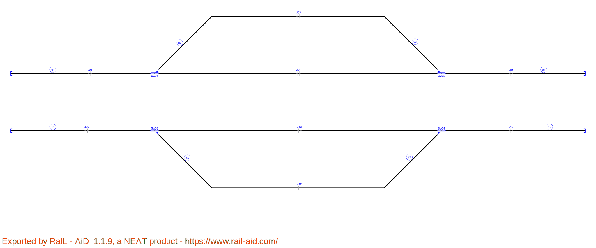
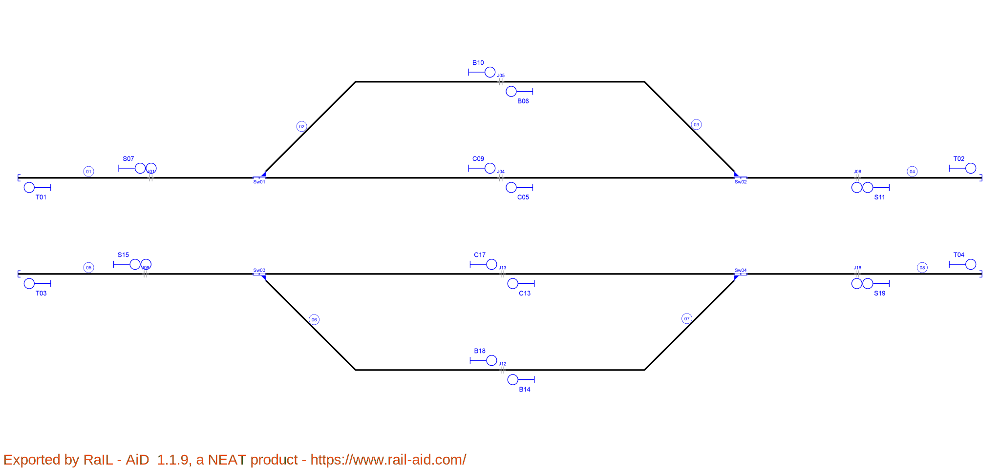
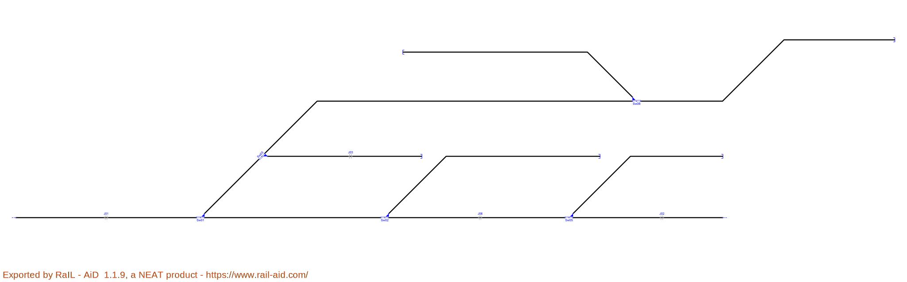
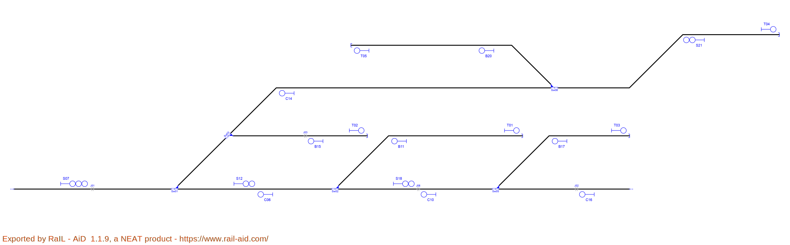
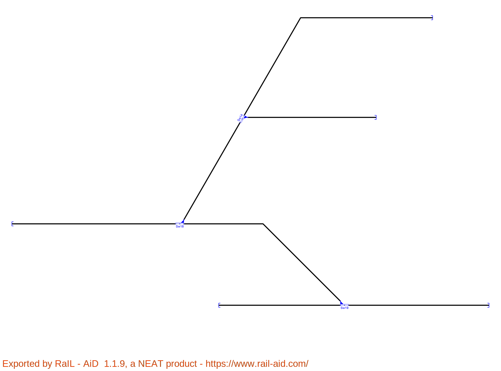
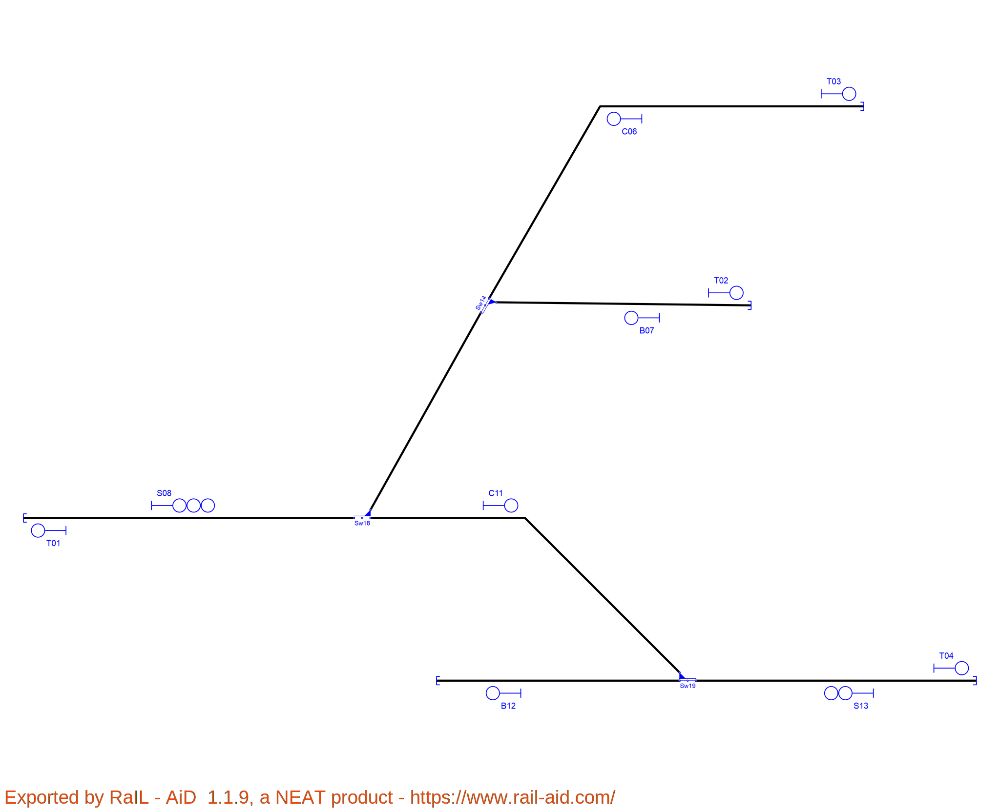

# Layout_1
Simple layout with double station with level crossing between.
### Before

### After

# Layout_2
Complex layout with seven stations and multiple switches.
### Before

### After

# Layout_3
Complex layout with three stations in a row.
### Before

### After

# Layout_4
Bypass topology.
### Before

### After

# Layout_5
Complex topology for horizontal and vertical signal inheritance.
### Before

### After

# Layout_6
Simple topology for horizontal and vertical signal inheritance.
### Before

### After

